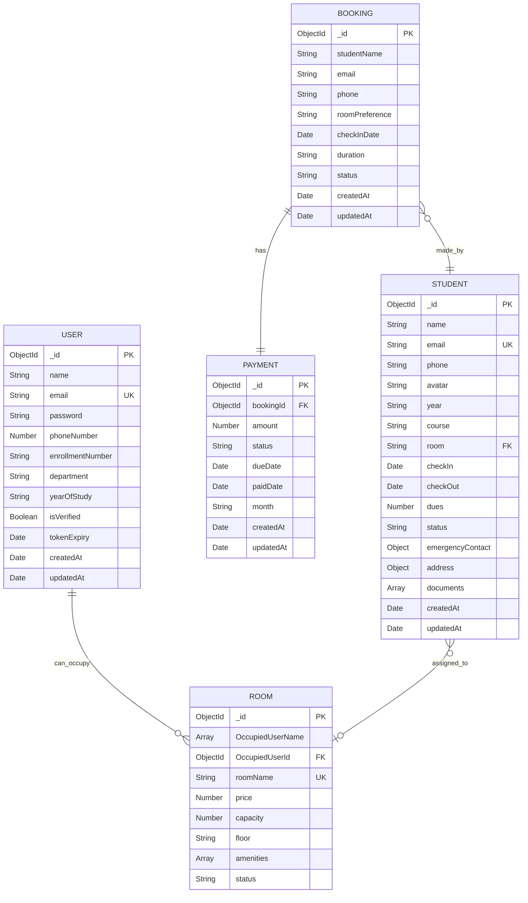

# Hostel Management System - Entity Relationship Diagram

## Database Schema Overview

This document describes the database schema for the Hostel Management System with detailed entity relationships.

## Entities and Relationships

## Detailed Entity Descriptions

### 1. USER Entity
- **Primary Key**: `_id` (ObjectId)
- **Purpose**: Stores user authentication and basic profile information
- **Unique Constraints**: `email`
- **Relationships**: 
  - One-to-Many with ROOM (a user can occupy multiple rooms over time)

### 2. STUDENT Entity
- **Primary Key**: `_id` (ObjectId)
- **Purpose**: Stores detailed student information and hostel-specific data
- **Unique Constraints**: `email`
- **Relationships**: 
  - Many-to-One with ROOM (students can be assigned to rooms)
  - One-to-Many with BOOKING (a student can make multiple bookings)

### 3. ROOM Entity
- **Primary Key**: `_id` (ObjectId)
- **Purpose**: Stores room information and availability
- **Unique Constraints**: `roomName`
- **Relationships**: 
  - Many-to-One with USER (referenced by OccupiedUserId)
  - One-to-Many with STUDENT (multiple students can be assigned to a room based on capacity)

### 4. BOOKING Entity
- **Primary Key**: `_id` (ObjectId)
- **Purpose**: Stores booking requests and their status
- **Relationships**: 
  - One-to-One with PAYMENT (each booking has associated payment)
  - Many-to-One with STUDENT (linked by email, not direct foreign key)

### 5. PAYMENT Entity
- **Primary Key**: `_id` (ObjectId)
- **Purpose**: Stores payment information for bookings
- **Foreign Keys**: `bookingId` (references BOOKING)
- **Relationships**: 
  - Many-to-One with BOOKING (multiple payments per booking for monthly fees)

## Relationship Details

### 1. USER ↔ ROOM Relationship
- **Type**: One-to-Many (Optional)
- **Implementation**: `ROOM.OccupiedUserId` references `USER._id`
- **Description**: A user can be assigned to a room, rooms can have no occupant

### 2. STUDENT ↔ ROOM Relationship
- **Type**: Many-to-One (Optional)
- **Implementation**: `STUDENT.room` stores room name as string
- **Description**: Multiple students can be assigned to same room (based on capacity)

### 3. BOOKING ↔ PAYMENT Relationship
- **Type**: One-to-Many
- **Implementation**: `PAYMENT.bookingId` references `BOOKING._id`
- **Description**: Each booking can have multiple payments (monthly payments)

### 4. BOOKING ↔ STUDENT Relationship
- **Type**: Many-to-One (Logical)
- **Implementation**: Linked by email field (no direct foreign key)
- **Description**: Students can make multiple bookings over time

## Business Logic Constraints

1. **Room Capacity**: Room capacity determines maximum students that can be assigned
2. **Payment Generation**: Payments are auto-generated when bookings are created
3. **Booking Status**: Controls the flow from application to confirmation
4. **Student Status**: Tracks student's current state in the hostel

## Database Indexes

### Recommended Indexes for Performance:
- `USER.email` (Unique Index)
- `STUDENT.email` (Unique Index)
- `STUDENT.status` (Non-unique Index)
- `STUDENT.room` (Non-unique Index)
- `ROOM.roomName` (Unique Index)
- `PAYMENT.bookingId` (Non-unique Index)
- `PAYMENT.status` (Non-unique Index)